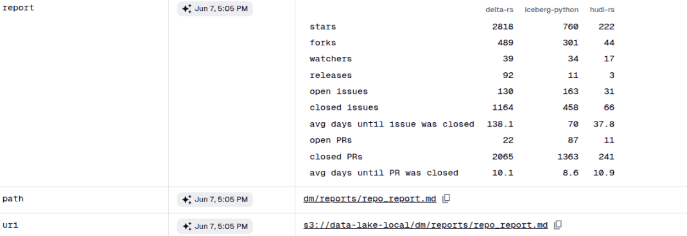

This document outlines the steps to set up and run the GitHub reporting pipeline using Poetry, Docker, MinIO, and Dagster. Each step includes a clear explanation of its purpose.




## Recent Additions

Assets:
1. A new helper function, fetch_repo_data, was introduced to centralize the fetching of all relevant repository data.
2. The fetch_repo_data function was implemented to leverage the enhanced GitHubAPIResource for retrieving releases, issues, and pull requests.
3. The validate_repo_data utility function was integrated into fetch_repo_data to ensure the integrity of fetched data.
4. Comprehensive logging was added to the fetch_repo_data function to provide visibility into the data collection process and metrics.
5. Robust error handling and logging were implemented within fetch_repo_data to propagate asset failures.
6. The individual repository metadata assets (delta_rs_metadata, iceberg_python_metadata, hudi_rs_metadata) were refactored to utilize the new fetch_repo_data helper function.
7. The output metadata for the repository metadata assets was updated to reflect the more comprehensive repo_data structure.
8. The docstring for hudi_rs_metadata was corrected.
9. The repo_report asset was updated to correctly pass the full repo_data dictionary to the extract_metadata function, resolving a typo in the parameter name.

Defintions:
1. Functionality for using mock values was introduced with a flag (the GITHUB_USE_MOCK environment variable) directly within this file, allowing for easy switching between real and mock GitHub API interactions.

Mock values:
1. A new file, mock_github.py, was introduced to provide a mock implementation for GitHub API responses.
2. The MockGitHubData class was created to define pre-configured, static mock data for repository metadata, releases, issues, and pull requests for specific repositories.
3. The mock data was deliberately crafted to allow for the manual inclusion of malformed values, thereby facilitating the testing of data validation.
4. The MockGitHubAPI class was implemented to mimic the public interface of the real GitHubAPIResource, returning mock data instead of making actual network requests.
5. The MockGitHubAPI class was equipped with a set_mock_data method, enabling the dynamic overriding of default mock data for specific test scenarios.
6. The get_issues and get_pull_requests methods within MockGitHubAPI were designed to support filtering by issue/PR state ('open', 'closed', 'all') using the stored mock data.

Resources:
1. The GitHubAPIResource class now includes retry_attempts and retry_delay_seconds attributes to handle transient network issues and API rate limits.
2. A mock API implementation was integrated, allowing the resource to use mock data based on the GITHUB_USE_MOCK environment variable, which helps with testing and development without hitting the actual GitHub API.
3. The execute_request method was enhanced with retry logic and exponential backoff for failed requests, improving the resilience of API calls.
4. The execute_request method now includes specific handling for GitHub API rate limits (HTTP 403 with X-RateLimit-Remaining header), pausing execution until the rate limit resets.
5. A timeout parameter was added to requests.request calls within execute_request to prevent requests from hanging indefinitely.
6. The execute_request method now explicitly sets the X-GitHub-Api-Version header for better API compatibility and future-proofing.
7. The execute_request method was updated to differentiate between client (4xx) and server (5xx) HTTP errors, immediately re-raising client errors as they are typically not retryable.
8. A new private helper method, _paginate_request, was introduced to handle GitHub API's pagination by automatically fetching all pages of results for endpoints that support it.
9. New methods, get_releases, get_issues, and get_pull_requests, were added to fetch specific types of repository data.
10. The get_issues method now explicitly filters out pull requests to return only genuine issues.
11. The get_pull_requests method was implemented to fetch pull requests using the dedicated /pulls endpoint, handling the 'all' state by making separate calls for 'open' and 'closed' pull requests.
12. All new data retrieval methods (get_repository, get_releases, get_issues, get_pull_requests) were integrated with the mock API for consistent behavior in mock mode.

Utils:
1. The extract_metadata function was significantly enhanced.
2. It now includes the total number of releases for the repository.
3. The function now differentiates between open and closed issues, as well as open and closed pull requests (PRs).
4. It calculates and includes the average number of days it takes for issues and PRs to be closed.
5. A new helper function, validate_repo_data, was introduced to validate the input repo_data structure.
6. Another new helper function, calculate_avg_days_until_closed, was added to compute the average time taken to close issues or PRs.

Helper Average Close Time Calculator Script (Correctness Check):
1. This script calculates and prints the average time to close issues and pull requests for a specified GitHub repository using the GitHub API.

## 1. Project Setup and Environment Configuration

This section covers the initial setup of your development environment, including Python virtual environments, dependency management with Poetry, and cloning the project repository.

### 1.1. Create an Isolated Environment with `venv`

**Purpose:** Creating a virtual environment isolates your project's dependencies from your system-wide Python installation, preventing conflicts and ensuring consistent environments across different projects.

```bash
sudo apt update
sudo apt install python3.10 python3.10-venv python3-pip -y
```

# Create and activate virtual environment
python3.10 -m venv de-coding-challenge-env
source de-coding-challenge-env/bin/activate`

### 1.2. Install Poetry in this Virtual Environment

**Purpose:** Poetry is a dependency management and packaging tool for Python. Installing it within the virtual environment ensures that `poetry` itself is isolated and managed for this specific project.


`pip install poetry`

### 1.3. Clone the Project Repository

**Purpose:** This step downloads the source code of the `de-coding-challenge` project to your local machine, which contains the Dagster pipeline definitions and related code.

``` bash
git clone https://github.com/cornelsen/de-coding-challenge.git
```
### 1.4. Navigate to the Project Directory

**Purpose:** All subsequent commands related to the project should be run from within the project's root directory.

``` bash
cd de-coding-challenge
```
### 1.5. Configure Poetry to Create Virtual Environments In-Project

**Purpose:** By configuring `virtualenvs.in-project` to `true`, Poetry will create the virtual environment directly within your project directory (as a `.venv` folder). This makes the environment self-contained and easily discoverable.

``` bash
poetry config virtualenvs.in-project true
```

### 1.6. Ensure Poetry Uses Python 3.10

**Purpose:** This command explicitly tells Poetry to use Python 3.10 for creating and managing the project's virtual environment, aligning with the project's expected Python version.

``` bash
poetry env use /usr/bin/python3.10
```

### 1.7. Install Project Dependencies with Poetry

**Purpose:** `poetry install` reads the `pyproject.toml` and `poetry.lock` files to install all necessary project dependencies into the Poetry-managed virtual environment.

``` bash
poetry install
```

### 1.8. Add Dagster (if missing)

**Purpose:** This step ensures that `dagster` and `dagster-webserver` are explicitly added as project dependencies. While `poetry install` should handle most dependencies, this command serves as a safeguard in case they are not fully picked up or if you're starting a new project.

``` bash
poetry add dagster dagster-webserver
```
### 1.9. Verify Dagster Installation

**Purpose:** This command checks if Dagster is correctly installed and accessible within the Poetry environment by printing its version.

``` bash
poetry run dagster --version
```

## 2. Environment Variables and MinIO Setup

This section guides you through configuring environment variables and setting up MinIO, an S3-compatible object storage server, which will serve as your local data lake.

### 2.1. Create `.env` File for Local Environment Variables

**Purpose:** The `.env` file is used to store sensitive information and configuration specific to your local development environment, such as API tokens and user IDs, keeping them separate from your codebase.

``` bash
cp .env.template .env
```

**Edit the `.env` file:**

``` bash
nano .env 
```

Ensure the following lines exist in your `.env` file and replace placeholder values:

**Set `USER_ID` and `GROUP_ID`:**

**Purpose:** These IDs are often used in Docker environments to ensure file permissions are correctly handled between your host machine and the containers.

``` bash
id -u  # copy the result to HOST_UID (or USER_ID)
id -g  # copy the result to HOST_GID (or GROUP_ID)
```
In your `.env` file, ensure:

Code snippet

`USER_ID=your_actual_user_id
GROUP_ID=your_actual_group_id`

**Generate a GitHub Token:**

**Purpose:** A GitHub Personal Access Token is required to authenticate your requests to the GitHub API. This token increases your API rate limit significantly, preventing issues during data fetching.

1. Go to: https://github.com/settings/tokens
2. Click: “Generate new token (classic)”
3. **Do not select any scopes.** Just give it a name (e.g., “for script”) and click Generate.
4. Copy the generated token.
5. Edit your `.env` file to include:Code snippet
    
    `GITHUB_TOKEN=your_generated_token_here`
    
6. Save the file.

### 2.2. Prepare MinIO Data Folder

**Purpose:** This command creates a directory on your host machine where MinIO will store its data. This ensures persistence of your MinIO data even if the Docker container is removed.

``` bash
mkdir -p data/minio
```
### 2.3. Start MinIO using Docker

**Purpose:** This command starts the MinIO service as a Docker container. `docker compose up` reads the `docker-compose.yaml` file in your project to orchestrate the services.

``` bash
docker compose up
```

**Wait for confirmation:**

Wait until you see the following message, indicating the MinIO bucket has been successfully created:

Plaintext

`Bucket created successfully `s3/data-lake-local`.`

**Then press `Ctrl + C`** to stop the MinIO container. This initial run is just to set up the bucket; you'll run it again later for continuous operation.

### 2.4. Verify MinIO Health Status

**Purpose:** Before proceeding, it's crucial to ensure that the MinIO container is fully healthy and ready to accept connections. This command checks the health status of the MinIO Docker container.

``` bash
docker inspect --format='{{.State.Health.Status}}' de-coding-challenge-minio-1
```
Keep running this command until the status changes from `starting` to `healthy`.

### 2.5. Manually Create the MinIO Bucket (if needed)

**Purpose:** If the initial `docker compose up` run did not successfully create the `data-lake-local` bucket, these steps allow you to create it manually using the AWS CLI.

1. **Export credentials:**
    
    **Purpose:** These environment variables provide the AWS CLI with the necessary credentials to connect to your local MinIO instance.
    
    `export AWS_ACCESS_KEY_ID=minio
    export AWS_SECRET_ACCESS_KEY=password`
    
2. **Install AWS CLI (if you don’t have it yet):**
    
    **Purpose:** The AWS Command Line Interface (CLI) is a unified tool to manage your AWS services, including S3-compatible services like MinIO.
    
    `sudo apt install awscli -y`
    
3. **Use AWS CLI to create the bucket:**
    
    **Purpose:** This command uses the AWS CLI to create the `data-lake-local` bucket in your local MinIO instance, specifying the MinIO endpoint.
    
    `aws --endpoint-url http://localhost:9000 s3 mb s3://data-lake-local`
    

### 2.6. Verify Bucket Existence (Optional)

**Purpose:** This command lists all buckets in your MinIO instance, allowing you to confirm that the `data-lake-local` bucket has been successfully created.

``` bash
aws --endpoint-url http://localhost:9000 s3 ls
```

## 3. Running the Dagster Web UI and Pipeline

This section details how to start the Dagster Web UI and then use it to materialize the GitHub reporting pipeline assets.

### 3.1. Run the Web App (Dagster Web UI)

**Purpose:** `dagster dev` starts the Dagster webserver, which provides a graphical user interface (Dagit) to browse, run, and monitor your Dagster assets and jobs.

``` bash
source de-coding-challenge-env/bin/activate

cd de-coding-challenge

poetry run dagster dev
```

Then open this in your browser: [http://localhost:3000](https://www.google.com/search?q=http://localhost:3000)

You’ll see the Dagster Web UI.

### 3.2. Materialize Assets in Dagster UI

**Purpose:** "Materializing" an asset in Dagster means executing the underlying code that produces that asset. In this pipeline, it involves fetching GitHub data and generating reports.

**Step-by-step:**

1. Go to the **Assets** tab in the Dagster UI.
2. Find assets named like:
    - `delta_rs_repo_metadata`
    - `hudi_rs_repo_metadata`
    - `iceberg_python_repo_metadata`
3. **Materialize each asset individually** by clicking the "Materialize" button next to its name.
4. **Wait for them to complete successfully** (check the logs in the Dagster UI for status).
5. After all upstream assets (the `_repo_metadata` ones) are materialized, materialize the final `repo_report` asset.

## 4. Check MinIO Web UI (Optional)

**Purpose:** The MinIO Web UI provides a graphical interface to browse the contents of your local data lake, allowing you to verify that the Dagster pipeline has successfully stored the generated data.

MinIO runs at: [http://localhost:9090](https://www.google.com/search?q=http://localhost:9090)

**Login:**

- **Username:** `minio`
- **Password:** `password`

Once logged in:

1. Click "Object Browser" on the left sidebar.
2. Navigate to the bucket `data-lake-local`.
3. You should see folders/files created by your Dagster pipeline runs, such as:
    - `stage/github/repositories/delta-io/delta-rs/delta-rs_repo_metadata.json` (and similar for other projects)
    - `dmn/reports/repo_report.json` (or similar for the final report)

You can explore these files, download them, or verify their existence. If the bucket is empty or files are missing, it indicates that the upstream assets have not been successfully materialized in the Dagster UI. In that case, go back to Step 3.2.

---

# Dagster Webserver Local Access Setup

This guide helps you run the **Dagster webserver locally** and access it from other devices on the same Wi-Fi network (e.g., your phone or second laptop).

---

## Prerequisites

- Python installed
- `poetry` and `dagster` installed
- Project set up with Dagster integration
- Local network (Wi-Fi or LAN) access

---

## Setup Instructions

### Step 1: Install `dagster-webserver`

``` bash
pip install dagster-webserver
```

> This adds the dagster-webserver CLI tool to your environment.
> 

---

### Step 2: Create a Dagster Home Directory

```bash
mkdir -p ~/.dagster/dagster_home
```

---

### Step 3: Set the `DAGSTER_HOME` Environment Variable

```bash
export DAGSTER_HOME=~/.dagster/dagster_home
```

You can verify it with:

```bash
echo $DAGSTER_HOME
```

Expected output:

```bash
/home/your-username/.dagster/dagster_home
```

---

### Step 4: (Optional) Add a Minimal `dagster.yaml` Config

If not present, create it:

```bash
cat > ~/.dagster/dagster_home/dagster.yaml <<EOF
telemetry:
  enabled: false
EOF
```


---

## Run the Dagster / Minio Components

### Step 5: Start the Dagster Daemon (Required for Jobs & Schedules)

```bash
poetry run dagster-daemon run
```

> This background worker process:
> 
> - Launches **queued runs**
> - Executes **sensors and schedules**
> - Monitors the **run queue**

**Note:** Keep this terminal open while using Dagster.

---

### Step 6: Run MinIO and Dagster Containers (If applicable)

Make sure to start the containers using:

```bash
docker compose up
```

> This will spin up MinIO, Dagster webserver, and any other services defined in your docker-compose.yml.
> 

---

### ▶Step 7: Start the Dagster Webserver

Use `poetry` if your project uses it:

```bash
poetry run dagster-webserver -h 0.0.0.0 -p 3000
```

Or directly:

```bash
dagster-webserver -h 0.0.0.0 -p 3000
```

Open your browser at:

```
http://localhost:3000
```

---

## Access Dagster UI From Another Device

### Step 1: Get Your Host Machine's Local IP

```bash
hostname -I
```

Example:

```bash
172.16.4.200
```

---

### Step 2: Ensure Port 3000 is Open (for Ubuntu Firewall)

```bash
sudo ufw allow 3000
```

---

### Step 3: Open Dagster UI From Another Device

From any device on the same Wi-Fi:

```
http://172.16.4.200
```

